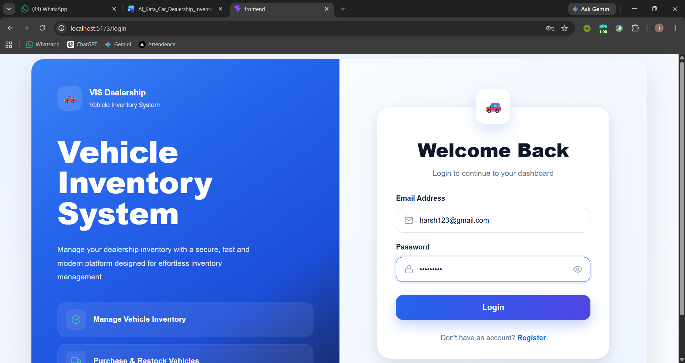
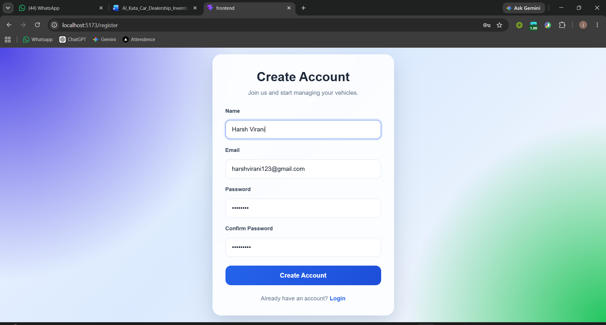
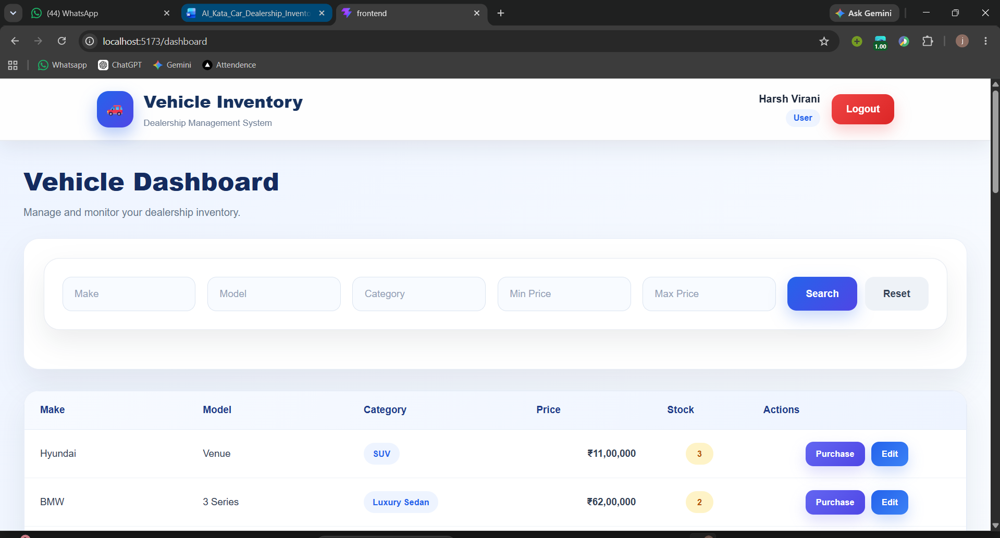
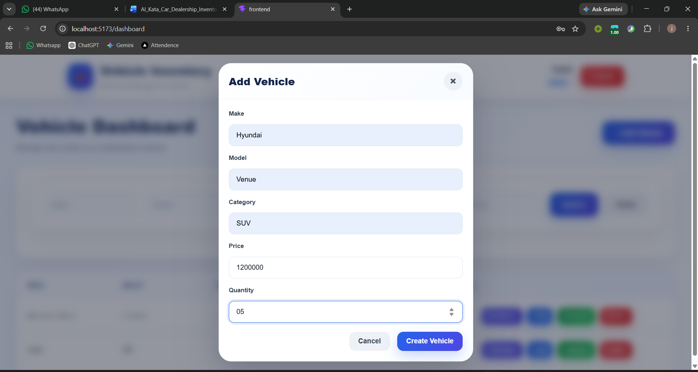
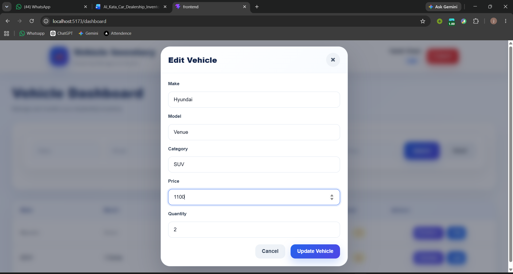
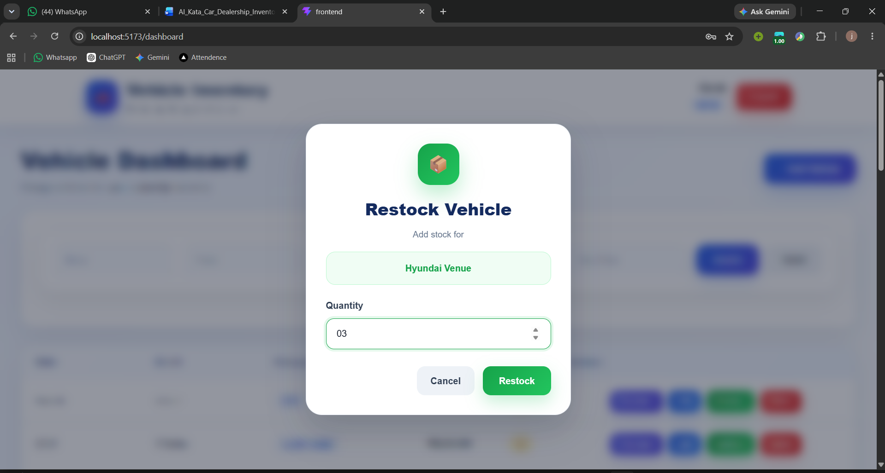
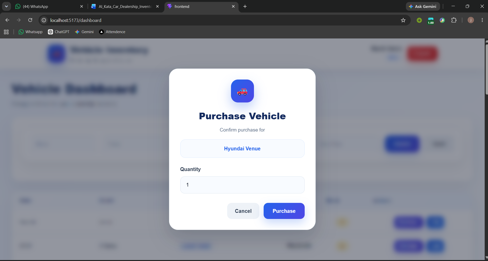
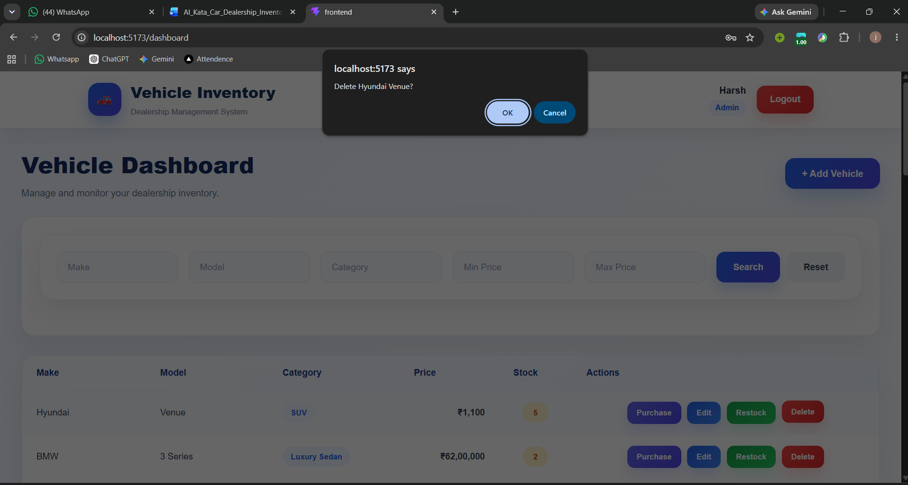

# Vehicle Inventory Management System

A full-stack Vehicle Inventory Management System built using the MERN stack. The application enables users to manage vehicle inventory, search vehicles, purchase vehicles, and allows administrators to perform inventory management tasks such as adding, updating, deleting, and restocking vehicles. The project follows a layered architecture with secure JWT authentication, role-based authorization, and a responsive React frontend.

---

# Project Overview

The Vehicle Inventory Management System is designed to simplify dealership inventory management. It provides a secure platform where authenticated users can browse available vehicles, search using multiple filters, and purchase vehicles. Administrators have additional privileges to create, update, delete, and restock inventory.

The project follows industry-standard backend architecture by separating concerns into Controllers, Services, Repositories, DTOs, Validators, and Middleware.

---

# Features

## Authentication

- User Registration
- User Login
- JWT Authentication
- Password Hashing using bcrypt
- Protected Routes
- Role-Based Authorization (Admin & User)

## Vehicle Management

- Add Vehicle (Admin)
- Update Vehicle (Admin)
- Delete Vehicle (Admin)
- View All Vehicles
- View Vehicle Details
- Search Vehicles
- Purchase Vehicles
- Restock Vehicles (Admin)

## Search & Filtering

- Search by Make
- Search by Model
- Search by Category
- Filter by Minimum Price
- Filter by Maximum Price

## Frontend Features

- Responsive UI
- Form Validation
- Toast Notifications
- Protected Dashboard
- Vehicle Table
- Search Filters
- Purchase Modal
- Restock Modal
- Edit Vehicle Modal

## Backend Features

- RESTful API
- Layered Architecture
- Repository Pattern
- DTO Pattern
- Centralized Error Handling
- Express Validator
- Environment Validation
- Async Error Handler
- MongoDB Atlas Integration

---

# Tech Stack

## Frontend

- React 19
- TypeScript
- Vite
- React Router DOM
- React Hook Form
- Zod
- Axios
- React Hot Toast
- Tailwind CSS

## Backend

- Node.js
- Express.js
- TypeScript
- MongoDB Atlas
- Mongoose
- JWT
- bcrypt
- express-validator
- dotenv

---

# Folder Structure

```
Vehicle-Inventory-System
│
├── backend
│   ├── src
│   │   ├── config
│   │   ├── controllers
│   │   ├── interfaces
│   │   ├── middlewares
│   │   ├── models
│   │   ├── repositories
│   │   ├── routes
│   │   ├── services
│   │   ├── tests
│   │   ├── types
│   │   ├── utils
│   │   ├── validators
│   │   ├── app.ts
│   │   └── server.ts
│   │
│   ├── .env
│   ├── jest.config.js
│   ├── package.json
│   └── tsconfig.json
│
├── frontend
│   ├── src
│   │   ├── api
│   │   ├── assets
│   │   ├── components
│   │   ├── context
│   │   ├── hooks
│   │   ├── pages
│   │   ├── routes
│   │   ├── services
│   │   ├── types
│   │   ├── utils
│   │   ├── App.tsx
│   │   ├── index.css
│   │   └── main.tsx
│   │
│   ├── .gitignore
│   ├── eslint.config.js
│   ├── index.html
│   ├── package-lock.json
│   ├── tsconfig.app.json
│   ├── tsconfig.json
│   ├── package.json
│   └── vite.config.ts
│
└── README.md
```

---

# Backend Setup

### Clone Repository

```bash
git clone <repository-url>
```

### Navigate

```bash
cd backend
```

### Install Dependencies

```bash
npm install
```

### Create Environment File

```env
PORT=5000
MONGODB_URI=your_mongodb_connection
JWT_SECRET=your_secret_key
JWT_EXPIRES_IN=7d
```

### Start Server

```bash
npm run dev
```

---

# Frontend Setup

Navigate to frontend

```bash
cd frontend
```

Install dependencies

```bash
npm install
```

Start development server

```bash
npm run dev
```

---

# Environment Variables

## Backend

```env
PORT=
MONGODB_URI=
JWT_SECRET=
JWT_EXPIRES_IN=
```

## Frontend

```env
VITE_API_URL=http://localhost:5000/api
```

---

# API Endpoints

## Authentication

| Method | Endpoint | Description |
|----------|---------------------|------------------|
| POST | /api/auth/register | Register User |
| POST | /api/auth/login | Login User |

---

## Vehicles

| Method | Endpoint | Access |
|----------|------------------------------|------------|
| GET | /api/vehicles | Authenticated |
| GET | /api/vehicles/:id | Authenticated |
| GET | /api/vehicles/search | Authenticated |
| POST | /api/vehicles | Admin |
| PUT | /api/vehicles/:id | 
| DELETE | /api/vehicles/:id | Admin |
| POST | /api/vehicles/:id/purchase | Authenticated |
| POST | /api/vehicles/:id/restock | Admin |

---

# Screenshots

Add screenshots of the following pages:











---

# Testing

The application was manually tested using:

- Postman
- Browser Testing
- MongoDB Atlas

Tested functionality includes:

- User Registration
- User Login
- JWT Authentication
- Protected Routes
- Admin Authorization
- CRUD Operations
- Vehicle Purchase
- Vehicle Restock
- Vehicle Search
- Form Validation
- Error Handling

---

# My AI Usage

### AI Tools Used

- ChatGPT

### How AI Was Used

ChatGPT was used as a development assistant throughout the project. It helped with learning concepts, improving code quality, debugging issues, and generating documentation. All generated code was reviewed, modified, tested, and integrated manually.

Examples of AI assistance include:

- Designing the layered backend architecture.
- Understanding and implementing the Repository Pattern.
- Creating DTOs and validation schemas.
- Debugging backend and frontend issues.
- Improving React component structure.
- Creating responsive UI layouts.
- Improving error handling.
- Writing css styles for components.

AI-generated suggestions were reviewed and adapted before being incorporated into the final implementation.

---

# Author

**Harsh Virani**

MCA Student

GitHub: https://github.com/Harsh9413

LinkedIn: https://linkedin.com/in/harsh-virani94